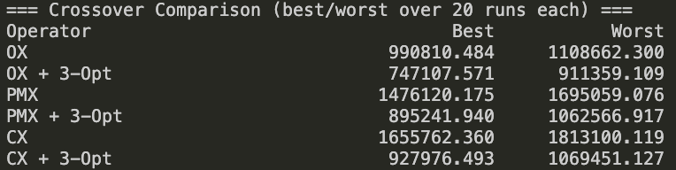
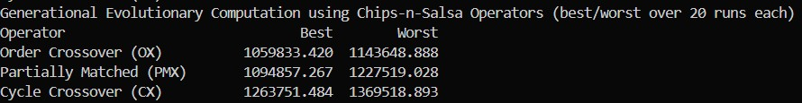
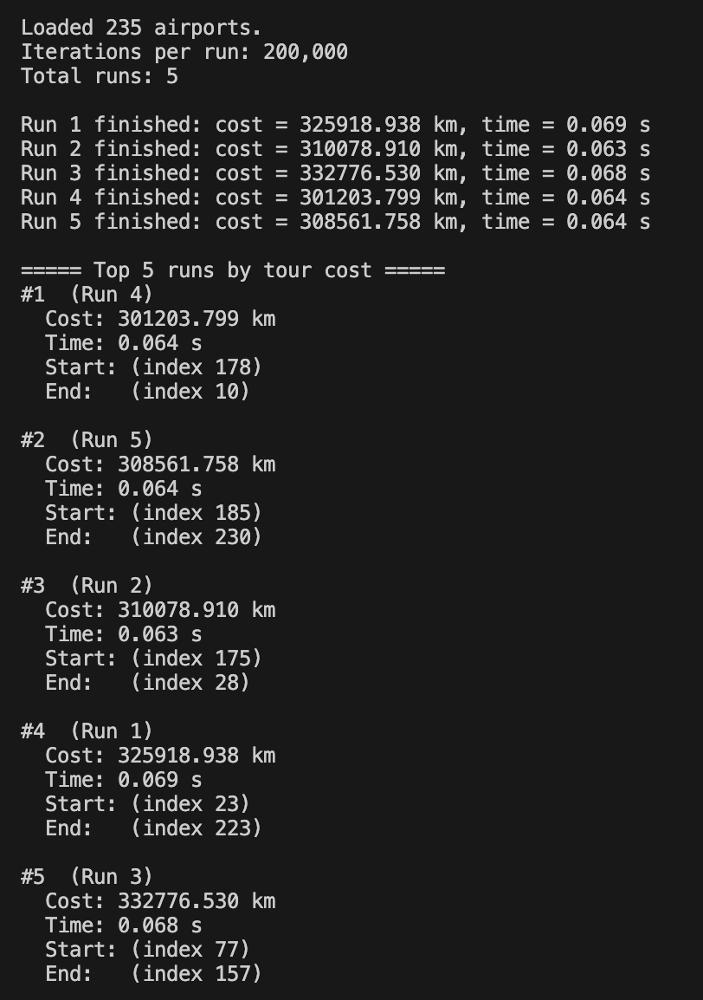
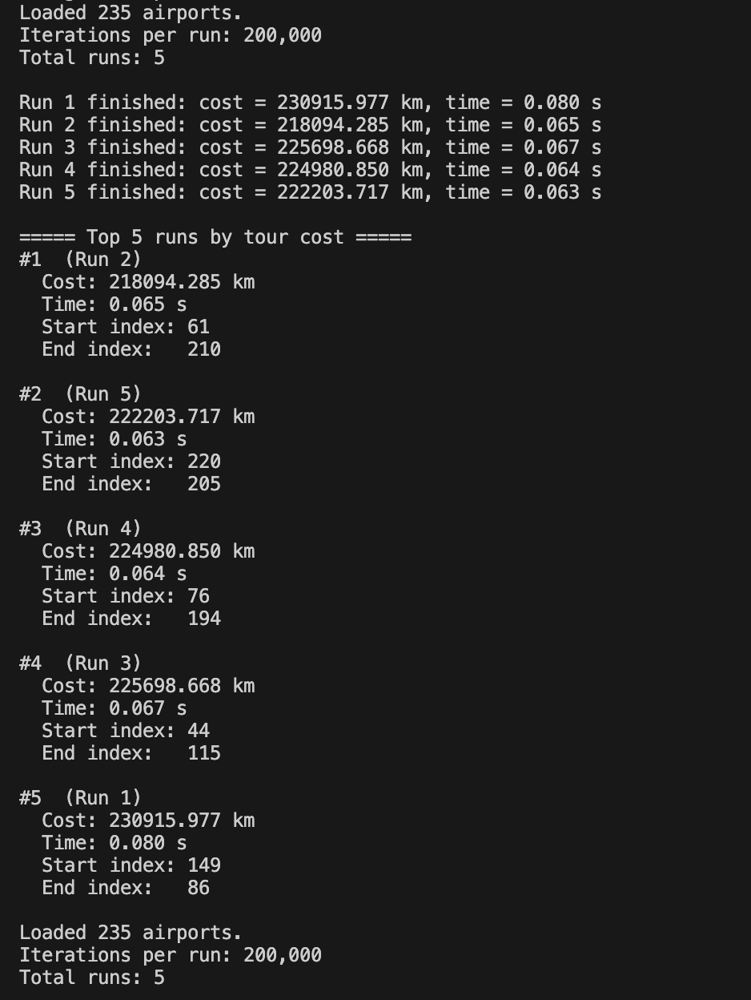
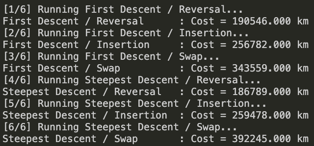

## Introduction
It has never been easier to travel the world. With a few clicks in a web browser, we can buy a ticket and be halfway around the globe in hours. The question, however, is how to spend less time in the air and more time on the ground. By exploring the Traveling Salesperson Problem (TSP), we can attempt to optimize our itinerary by finding the shortest route that takes us to almost every country with an international airport.

In this project, we clearly define our TSP instance as follows: we wish to visit one airport in every country that has an international airport, and we want to do so while minimizing the total travel distance, thereby reducing the amount of time spent in flight. To model this, we construct a CSV file containing the key attributes of each airport (name, country, longitude, and latitude). Using this data, we then apply a variety of evolutionary algorithms, implemented via the Chips-n-Salsa library, to search for high-quality solutions to this global routing problem.

Evolutionary algorithms are a natural fit for this problem because the search space is much too large for a rudimentary or brute force approach to handle, especially when dealing with an NP-hard problem like TSP. Using an evolutionary approach allows us to generate diverse populations of possible tours in a fraction of the time it would take to manually design a single route. By leveraging the crossover, mutation and local search operators from the Chips-n-Salsa library, we can efficiently navigate this massive landscape and discover near optimal routes that will significantly reduce total travel distance.

The goal of this project was to implement and do a deeper dive into evolutionary computation methods, a subsector of artificial intelligence algorithms. These algorithms are inspired by real biological properties like evolution and mutation. Social Darwinistic methods of altering data were also thought of to solve optimization problems, sometimes we may find it best to keep the most elite members of a population, whilst manipulating the rest. We find these algorithms to be useful to our problem as the optimal-TSP is under the NP Hard category, so these algorithms will have self-employed ways to escape local optima.

## Project Workflow
To complete this project efficiently and within our time constraints, our group established a structured workflow centered around clear communication and strategic division of labor. We relied on the messaging platform Discord for real-time coordination, allowing us to troubleshoot issues quickly, discuss algorithmic decisions, and maintain momentum throughout development.

#### Role Assignment Based on Strengths
Our general methodology for assigning work was to align responsibilities with each member’s strengths to maximize productivity and project quality.

 •	Tyler and Alexis—the most experienced programmers—were designated as the primary code reviewers, ensuring consistency, quality, and correctness across the codebase.

 •	Alexis, who proposed the initial idea for the project, served as the project lead, guiding design choices, coordinating major tasks, and helping ensure cohesive integration.

 •	Tasnim, whose strengths lie in mathematics, was tasked with implementing Haversine Distance, a core component used by all algorithms that required accurate geographic distance computation.

 •	Michael and Owen took on the bulk of the documentation, including this report, the proposal, and descriptive summaries of the project’s technical structure.

This division of labor allowed members to focus on specialized areas while contributing meaningfully to the project’s overall technical and conceptual development.

#### Version Control
The repository owner, tylermong, set up the project structure on GitHub and provided guidelines for creating issues, submitting pull requests, and organizing branches. This workflow ensured that every member could manage their work locally while contributing safely and consistently to the shared repository. It also helped each person gain a stronger understanding of the project as a whole, since every contribution was reviewed, discussed, and integrated collaboratively.

## Methodology
Our approach to solving this global Traveling Salesperson Problem (TSP) combined structured data preparation, accurate geographic distance modeling, and a range of evolutionary and local-search algorithms implemented through the Chips-n-Salsa optimization library (Cicirello, 2022). The following sections outline the major methodological components of the project.

1. Problem Representation

To define our TSP instance, we constructed a CSV file containing one international airport for every country that has one. This dataset was derived from publicly available airport data provided by OurAirports (OurAirports, n.d.). Each entry included:

- Airport name

- Country

- Longitude (positive for East, negative for West)

- Latitude (positive for North, negative for South)

This ensured global coverage and provided a consistent dataset for all algorithmic implementations. Each airport was represented in Java by an Airport class, which stored its geographic coordinates for efficient distance lookup and reuse across all algorithms.

2. Distance Calculation (Haversine Formula)

Because the Earth is spherical, standard Euclidean distance produces inaccurate results when applied to long-distance, global-scale problems. To address this, we used the Haversine distance formula, implemented by Tasnim, to compute the great-circle distance between any two airports. This approach provides a more accurate measure of real-world air travel distance based on latitude and longitude coordinates, improving the realism and applicability of the results.

3. Tour Representation and Fitness Evaluation

Each potential solution was represented as a permutation of airport indices, indicating the order in which airports are visited. The fitness function for all algorithms was defined as the total Haversine distance of the tour, computed by summing the pairwise distances between consecutive airports and including the return trip to the starting airport. Lower total distances were used as the primary indicator of better solutions.

4. Evolutionary Algorithms and Operators

Each team member implemented at least one evolutionary operator or search strategy, allowing the group to compare multiple approaches under a unified optimization framework provided by the Chips-n-Salsa library (Cicirello, 2022). This structure enabled consistent evaluation of algorithm performance while highlighting the strengths and weaknesses of different evolutionary and local-search techniques when applied to the same global TSP instance.

#### Crossover Operators (Alexis):
•	Order Crossover (OX)
•	Partially Matched Crossover (PMX)
•	Cycle Crossover (CX)

Each operator recombined two parent tours to generate new, diverse solutions. Alexis also implemented a 3-Opt local search step to demonstrate how incorporating local optimization can significantly improve crossover results.

#### Mutation Operators (Owen & Michael):
•	Swap
•	Insertion
•	Reversal

Mutations introduced additional variation to avoid premature convergence.

#### Local Search Algorithms (Owen):
•	Steepest-Ascent Hill Climbing
•	First-Choice Hill Climbing

These methods iteratively improved a tour by exploring neighboring permutations.

#### Simulated Annealing (Michael):
Implemented with both insertion and swap mutations to compare performance across cooling schedules and random restarts.

#### Generational Evolutionary Algorithm (Tasnim):
Included permutation initialization, elitism, and multiple crossover operators to explore population-based optimization.

#### Greedy Algorithms (Tyler):
• Nearest Neigbor
• Repeated Nearest Neighbor

These methods were implemented to outline how good results can be constrained by long run times with larger datasets.

5. Experimental Procedure
For each algorithm, we conducted multiple runs to evaluate consistency and robustness. Across these runs we recorded:

      •	Best distance found

      •	Worst distance

      •	Runtime

      •	Improvements resulting from 3-Opt

      •	Variation across crossover and mutation operators

The results were then compiled and compared to visualize algorithm performance and identify strengths and weaknesses.

## Results
With regard to crossover operators, we quickly found that while they adequately randomized the population to create diverse generations, we lacked an effective method for preserving high-quality solutions. Tournament selection’s inherent randomness appeared to cause the loss of several promising parents that may have contributed to better future generations, and our results reflected this issue. Even Order Crossover, our strongest performer among the three tested (Order, Partially Matched, and Cycle), produced outcomes that fell short when compared to other genetic algorithm approaches we explored.

 
 
It was only after implementing a 3-Opt local search operator that we observed noticeably improved and more consistent results. Even then, our findings suggest that although crossover effectively generates variation and helps maintain population diversity, it is insufficient on its own when attempting to optimize and reach high-quality solutions for this problem.

Tasnim's implementation of Genetic Evolutionary Computation experiments pointed to Order Crossover (OX) as the clear winner, securing the best route with a total distance of about 1.06 million km. Partially Mapped Crossover (PMX) performed overall well,  while Cycle Crossover (CX) had a harder time, falling 18% behind the top score. We saw consistent convergence across all 20 runs, and it became obvious that mutation was the key factor helping the system avoid getting stuck in local loops (local optima) to find a better final path.

 

Michael started by testing an insertion-style mutation on its own to see how well it could solve the TSP:

 
 
The mutation was able to make reasonable local changes to the tour, but it often got stuck in local minima and stopped improving after a while. Results also varied a lot between runs, which suggested that mutation alone was not reliable for consistently finding good solutions.

We then applied simulated annealing using a two-change mutation operator:

 

This approach produced better and more consistent tour costs across multiple runs. By occasionally accepting worse solutions early on, simulated annealing was able to escape local minima and continue improving the tour, which made it clearly more effective than using insertion-style mutation by itself.

For our greedy hill climbers, implementation using Vincent Cicirello's "Chips-n-Salsa" was chosen to apply both first descent and steepest descent hill climbing. Since this is a reduction problem, trying to get the shortest distance, we will be doing descent compared to ascent. Within these two we will apply 3 different mutation operators to them: swap, insertion, and reversal: 

 

Within this output, we can see that while the reversal mutation yielded the lowest tour, the steepest descent approach had proven slightly better than first descent. This output also shows that the swap mutation might not be viable for hill climbing, as the outputs we got are way too large in comparison to that of reversal and insertion mutation application.

#### Best Run Summary Across Algorithms

To make our comparison clearer, below we identified the single best tour produced by each major method from the recorded outputs:

Repeated Nearest Neighbor (RNN): best tour distance = 199,364.81 km

Hill Climbing: best tour distance = 186,789.00 km (Steepest Descent + Reversal)

Simulated Annealing: best tour distance = 218,094.285 km

Insertion Mutation (standalone): best tour distance = 301,203.799 km

Crossover methods :

Best pure crossover result: OX = 990,810.484 km

Best crossover + local improvement: OX + 3-Opt = 747,107.571 km

Generational Evolutionary Computation:

Best operator result: OX = 1,059,833.420 km

Overall, the best tour found in the entire project from all of our runs was 186,789.00 km from Steepest Descent Hill Climbing using Reversal mutation, which slightly outperformed the greedy baseline (RNN) and clearly outperformed our mutation-only and crossover-only approaches.

## Conclusion

This project showed that evolutionary computation and local-search methods can meaningfully improve solutions to a global Traveling Salesperson Problem using real airport locations and Haversine distance. Across our experiments, we saw that different methods had very different strengths depending on how well they balanced exploration (trying new structures) and exploitation (refining good routes).

When comparing best outcomes, Steepest Descent Hill Climbing with Reversal mutation produced the best tour overall (186,789.00 km), slightly beating our greedy baseline (RNN at 199,364.81 km). Simulated annealing performed better than using insertion mutation by itself in our runs (best 218,094.285 km vs 301,203.799 km), showing that controlled randomness can help avoid stagnation. For evolutionary crossover operators, results improved substantially once we added 3-Opt, but even the best crossover + 3-Opt outcome remained far above the best local-search results, suggesting that our crossover setup likely needed stronger selection/elitism or better integration with local search to compete on this instance.

Overall, our results reinforce that for this dataset and implementation, strong local search (especially steepest descent with the right neighborhood operator) was the most effective approach, and hybridizing evolutionary methods with local refinement is essential if we want population-based approaches to reach the same quality.

## References

Cicirello, Vincent A. (2022). Chips-n-Salsa: A Java library for optimization and search algorithms [Computer software]. https://chips-n-salsa.cicirello.org/

Megginson, David. (n.d.). OurAirports. https://ourairports.com/

